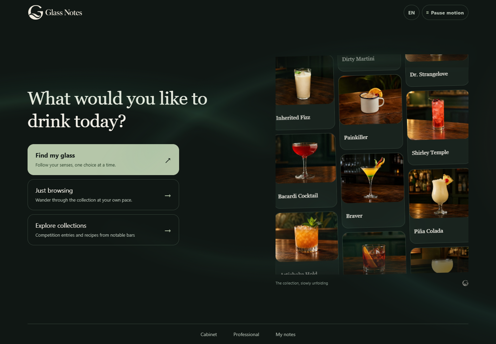
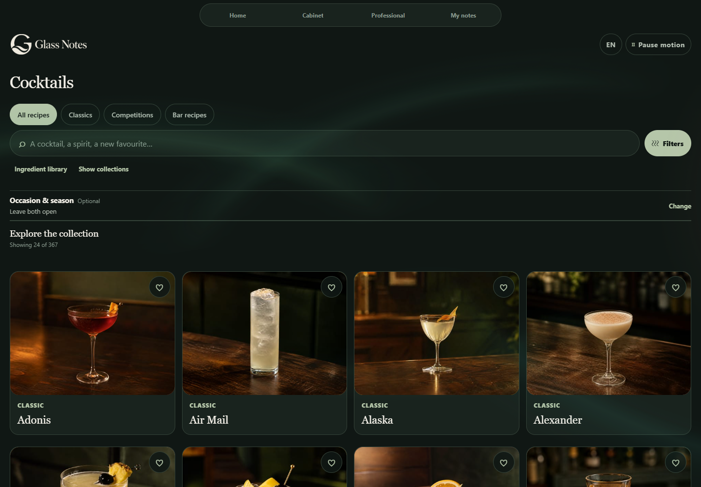

# Glass Notes

[中文](README.md) · English

Find a drink for tonight, make it with what you have, and remember what you enjoyed. Glass Notes is a personal cocktail app for discovering recipes, keeping a bottle cupboard and building your own recipe book, lists and tasting notes.

**367 cocktails · 371 source versions · 1,042 bottles · 8 interface languages**



[Features](#features) · [Get started](#get-started) · [Local data](#local-data-and-backups) · [Development](#development-and-builds) · [Sources and licence](#sources-and-licence)

[Open the website](https://glass-notes.pages.dev/) · [Download the Windows 0.1.8 preview](https://github.com/AlexShen-Oguri/glass-note/releases/tag/v0.1.8)

Use it in a desktop or phone browser, or download the Windows app. No account is needed, and personal records stay on your device.

## Features

### Choose by taste, or mix with what you own

Start with **Find my glass** on the home screen. Choose a mode, then explore aroma, taste, strength and the first-sip experience. Select several options or skip a question. Occasion, season and your saved taste memory are optional.

| Have a drink | Mix it myself |
| --- | --- |
| Find something that suits your taste. | Find recipes using the ingredients and bottles in your cupboard. |
| Read the reasons for a suggestion and open its recipe. | **Ready base spirits come first**, then fewer missing ingredients within each group. Recipes missing 3 or more ingredients are excluded; missing items are listed. |

If your cupboard is empty, you can add ingredients or choose by taste first. Before making a drink, check the recipe for quantities, equipment and ingredients that need advance preparation.

<p>
  
  
  
</p>

### Browse a visual catalogue and keep the right version

Search names, aliases and ingredients; filter by base spirit, included or excluded ingredients, flavour, technique or alcohol-free recipes. Browse classics, competition entries and published bar recipes, with optional occasion and season suggestions.

Each cocktail has one card, with its source versions available in the details. Filters find a version that matches all your choices; open the card to read that recipe.



Recipe details include ingredients, measures, steps, glassware, garnish, preparation notes and flavour guidance. Compare translated steps with the original text, or open the recipe and image sources.


### Your cupboard, ingredient library and bottle archive

Mark the ingredients and bottles you own so **Mix it myself** can suggest recipes using them.

Use the ingredient library to explore ingredients and related recipes. Search the bottle archive by product, brand, alias or flavour description; filter by category, inspect images and available strength information, mark ownership or select bottles for comparison.


### Follow a recipe or show an order card

Choose **Start making** to follow the ingredients, steps and practical tips. Progress saves automatically. When you finish, you can make another drink or return to the catalogue.

Recipes estimate alcohol content from ingredient measures and bottle information, leaving it blank when there is not enough information. The range is an estimate before ice dilution. Do not use it to judge driving or drinking safety.

An order card presents the drink name, ingredients and explicit requests. Use the app language or source language, show the card, copy its text or share text where the platform supports it. Your private tasting notes are not included.

<p>
  
  
</p>

### Favourites, personal lists and taste memory

Favourite a specific recipe, or create a list for a weekend, gathering or tasting session. **Add drinks** opens the same visual catalogue used for browsing, where you can select the exact version to save.

Lists retain a snapshot of the recipe at the time it was added. Read that saved recipe or open the current catalogue version separately. Cards show the drink image and group its saved source versions together.


**Record taste** opens a drink-specific flavour experience. Record whether you drank or made it, liked or disliked the version, found it too sweet or strong, and which aromas you enjoyed. A private note is optional.

Your saved taste ratings can inform future recommendations. Choose whether to use taste memory each time you look for a drink.

### Your recipes, including your own photos

Start from scratch, copy an exact catalogue recipe or take a version from the lab. Edit ingredients, quantities, steps, glassware, garnish and notes. Saving changes retains revision history.

Choose a photo for your recipe and save it with the ingredients, steps and notes. Recipe backups include the photo.


### Research topics and your lab

| Tool | What it supports |
| --- | --- |
| Research topics | Explore curated works by country, competition and bar; open exact catalogue versions where available. |
| Bottle comparison | Compare product information and create a controlled comparison from scratch or from an existing recipe. |
| Recipe versions | Create projects, edit quantities and methods, copy the next version and compare changes. |
| Trial batches | Preserve the recipe used for a batch; record time, temperature, aroma, palate, appearance, results and next steps. |
| Result comparison | Compare actual batches, continue from a chosen snapshot as a named version or save it to your recipe book. |

Lab entries autosave locally, ready for your next trial.


### Eight languages and responsive layouts

Chinese, English, French, German, Spanish, Korean, Japanese and Italian are available. The initial choice follows supported device languages; use the toolbar to change it. Drink and bottle names follow your chosen language, with the original name below when it differs.

All features are available in desktop and phone browsers. Switch liquid measures between ml and fl oz; other measures keep their original units. Page transitions, the cocktail waterfall and background motion can be paused and respect the system's reduced-motion preference.

## Local data and backups

Favourites, lists, cupboard records, recipes, experiments, making sessions, taste feedback and preferences stay in the current browser or app. They do not sync automatically to other devices.

When moving to another device, open **My → Backup & restore** to export a JSON file, then import it on the new device. Review the sections and conflicts in the preview before choosing merge or replace.

- Browser profiles, app installations and website origins (protocol, domain or port) have separate storage.
- Clearing site data, ending private browsing or uninstalling can remove records. Export before migrating.
- Backups include private notes and photos and **are not encrypted**. Keep them somewhere safe and avoid sharing them publicly.
- Replace can remove existing records in selected sections. Review the preview and keep an earlier backup.
- The website needs a network connection to load its pages and resources.

## Get started

The website needs no installation. On Windows, download the ZIP linked above, extract it and run the installer. Export a backup of your personal data before upgrading.

### Run from source

Use Node.js 24 and npm:

```sh
git clone https://github.com/AlexShen-Oguri/glass-note.git
cd glass-note
npm ci
npm run web
```

To run the exported website:

```sh
npm run build:web
npm run preview
```

Open http://127.0.0.1:4173. Rebuild after source changes. The preview server is for local testing.

## Development and builds

Expo, React Native and TypeScript share interface and domain code. The Windows app uses Tauri 2 to load a static Web export. Runtime use requires no application backend, database or model API key.

```sh
npm run validate
npm run brand:check
```

Validation runs type checks, behaviour and content tests, Web export and iOS JavaScript/resource export. Native iOS builds and signing are separate steps.

For Windows x64:

```sh
npm run desktop:prepare
npm run desktop:test
npm run desktop:build
```

Use Rust with the MSVC toolchain, Visual Studio C++ build tools and the Windows SDK. The installer targets the current user. Installed use requires WebView2, not Node.js or Expo. macOS and Linux installers are outside the current delivery scope.

For an independently hosted website:

```sh
npm run release:web
```

This produces a static archive, file hashes and a Caddy configuration example under `release/`. Deploy the contents of `site/` to a static hosting service.

| Directory | Responsibility |
| --- | --- |
| `src/app`, `src/features` | Routes and interface |
| `src/domain` | Search, recommendations, snapshots, calculations and validation |
| `src/content`, `src/media`, `assets` | Recipes, bottles, ingredients, localised content and images |
| `src/platform` | Storage, file selection, recovery and platform adapters |
| `src-tauri` | Windows host and bounded file bridge |
| `scripts`, `deploy` | Tests, builds, packaging and self-hosting examples |

See [architecture](docs/ARCHITECTURE.md), [hosting](docs/HOSTING.md) and [contributing](CONTRIBUTING.md).

## Releases and feedback

The current Windows version is the 0.1.8 public preview, and its installer is unsigned. See the [release notes and checksums](https://github.com/AlexShen-Oguri/glass-note/releases/tag/v0.1.8) for version details, tested scope and download verification.

For ordinary bug reports, include reproduction steps, platform and version. Do not attach personal backups, credentials or private information.

## Sources and licence

Original application code is licensed under [MIT](LICENSE), copyright 2026 AlexShen-Oguri. Third-party dependencies, photographs, datasets, reference material and trademarks retain their own terms.

Cocktail imagery includes AI-created illustrations, with sources and generation records in recipe details and image manifests. Some drink names use editorial translations. Flavour descriptions and alcohol estimates are for reference.

Redistribution permission for some third-party product photographs remains unconfirmed. Assets shown in README screenshots also retain their own licences. Before reuse, consult [third-party notices](THIRD_PARTY_NOTICES.md), [photo attribution](assets/photos/ATTRIBUTION.md) and the relevant asset records.
