# Glass Notes

中文 · [English](README.en.md)

从今天想喝什么，到记住自己喜欢什么。Glass Notes 是一款专注个人体验的鸡尾酒工具：按口味选酒，用手边材料调酒，保存自己的配方、酒单和风味笔记。

**367 款鸡尾酒 · 371 个来源版本 · 1,042 款瓶装酒 · 8 种界面语言**

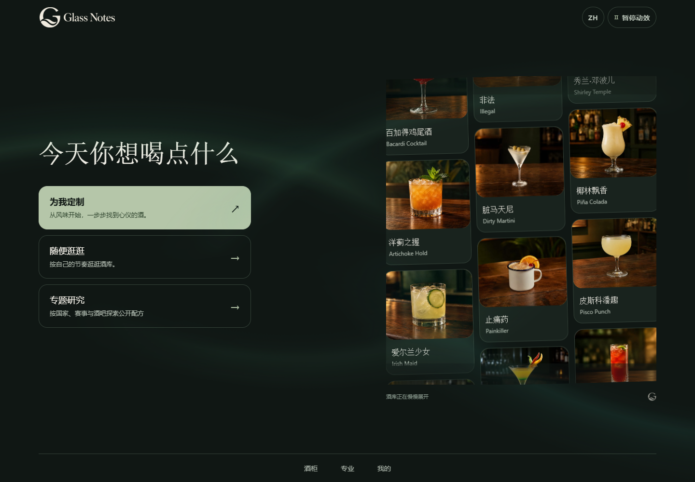

[功能介绍](#功能介绍) · [开始使用](#开始使用) · [本地数据](#本地数据与备份) · [开发与构建](#开发与构建) · [来源与许可](#来源与许可)

[打开网页版](https://glass-notes.pages.dev/) · [下载 Windows 0.1.8 测试版](https://github.com/AlexShen-Oguri/glass-note/releases/tag/v0.1.8)

在电脑或手机浏览器中直接使用，也可以下载 Windows 桌面版。无需注册，个人记录保存在自己的设备上。

## 功能介绍

### 按心情选一杯，或用已有材料自己调

从首页进入“为我定制”，先选一种模式，再回答香气、口感、酒感和第一口的偏好。可以多选或跳过，也可以加入场合、季节条件，以及自己保存的口味记忆。

| 喝一杯 | 自己调 |
| --- | --- |
| 从口味出发寻找合适的酒。 | 根据酒柜里已有的材料和瓶款推荐配方。 |
| 查看推荐理由，再进入具体配方。 | **先基酒齐全，同组再按缺料数量排序**；排除缺少 3 种及以上材料的配方，并列出缺项。 |

酒柜为空时，可以先添加材料，也可以直接按口味选酒。制作前请查看配方，确认用量、器具及需要提前准备的材料。

<p>
  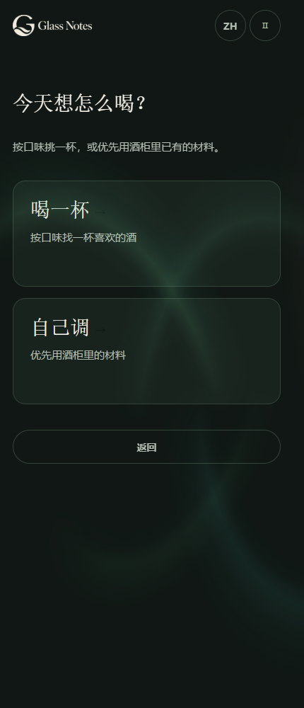
  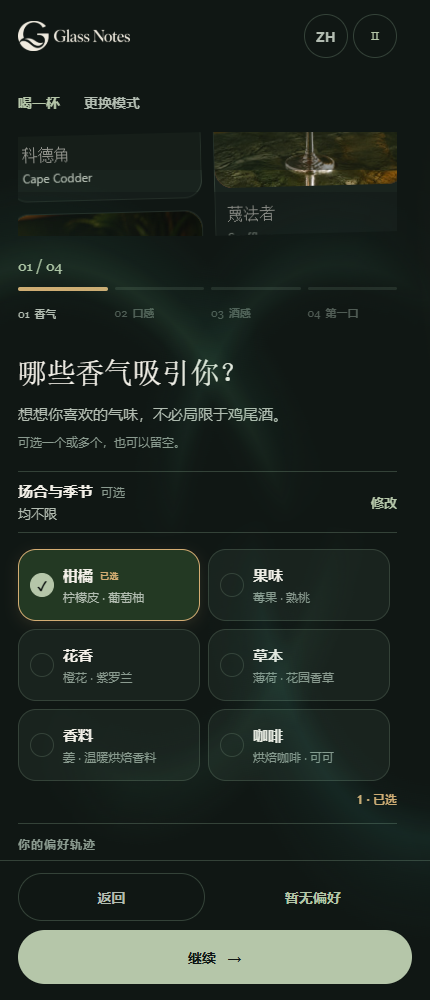
  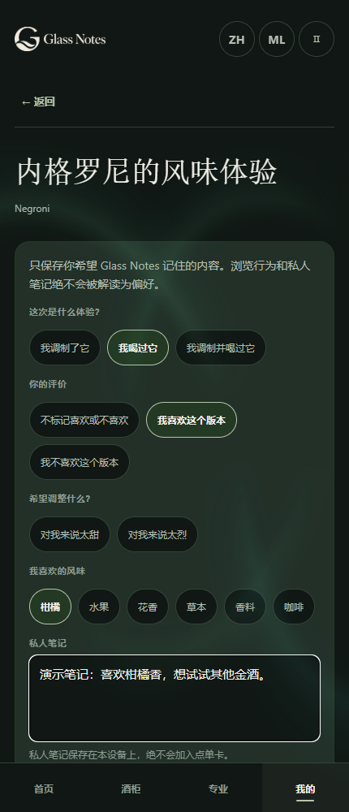
</p>

### 看着图片逛酒单，找到确切配方

“随便逛逛”支持名称、别名和材料检索，以及基酒、材料包含与排除、风味、手法和无酒精条件。也可以按经典鸡尾酒、竞赛作品、知名酒吧配方浏览，结合场合与季节缩小选择。

每款酒用一张卡片展示，详情中可以切换不同来源的配方。筛选会找到同时满足所选条件的版本，点击卡片即可查看。

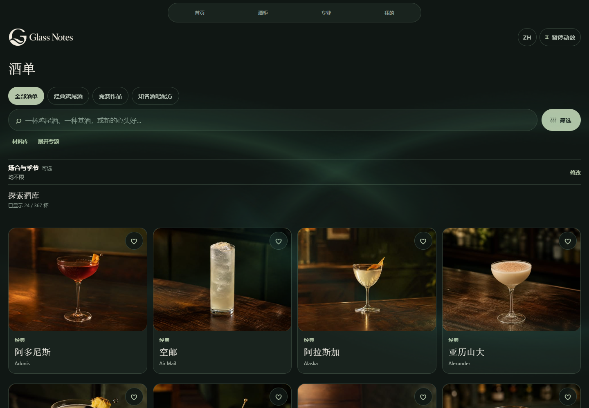

配方详情提供材料与用量、制作步骤、杯型、装饰、预制说明和风味提示。可以对照原文阅读步骤，也可以打开配方出处和图片来源。

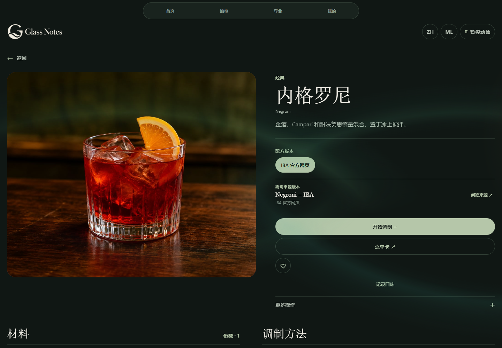

### 酒柜、材料库与瓶款档案

在酒柜中标记已有的材料和瓶款，“自己调”就能据此推荐配方。

材料库帮助查看材料及相关配方；瓶款档案支持名称、品牌、别名和风味描述搜索，以及品类筛选。可查看瓶图、酒精度与产品说明，标记拥有，或选择瓶款进行比较。

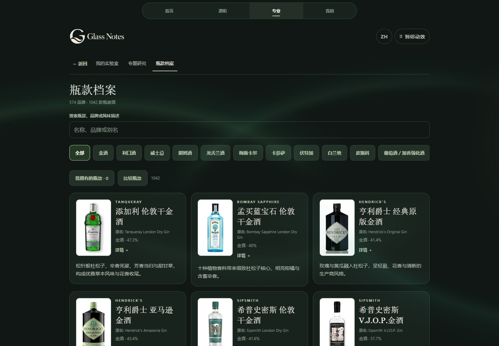

### 跟着配方调制，或出示一张点单卡

点击“开始调制”，按顺序查看材料、步骤和制作提示。进度会自动保存，做完后可以再调一杯或返回酒单。

配方会根据材料用量与瓶款资料自动估算酒精度，资料不足时留空。数值为融冰前的估算范围，不能用于判断驾驶或饮酒安全。

点单卡把酒名、材料和明确的个人要求放在简洁卡片中，可选择应用语言或来源语言、出示卡片、复制文字，或在平台支持时分享文字。私人风味笔记不会混入点单内容。

<p>
  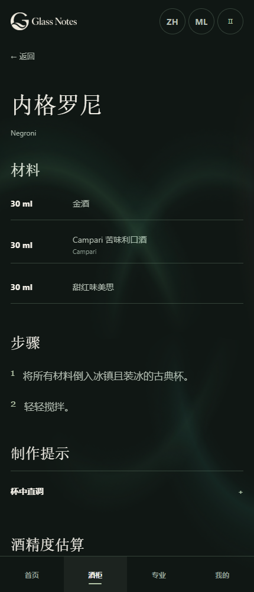
  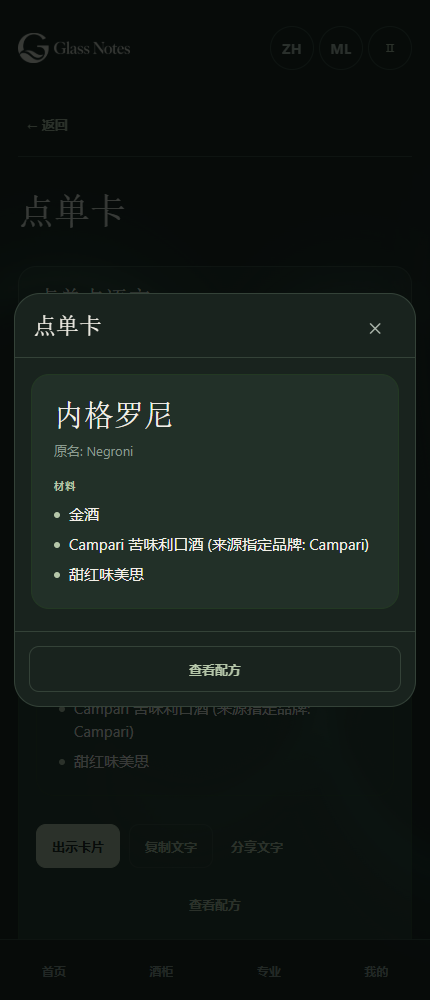
</p>

### 我的收藏、私人酒单与口味记忆

喜欢一个配方可以直接收藏；想为周末、聚会或试饮整理一组酒，可以创建私人酒单。“添加酒款”进入同一套图片酒库，选好具体版本后加入。

酒单保留添加时的确切配方快照，可以分别查看保存的配方和酒库中的当前配方。卡片显示酒图，同款酒的不同来源版本归在一起。

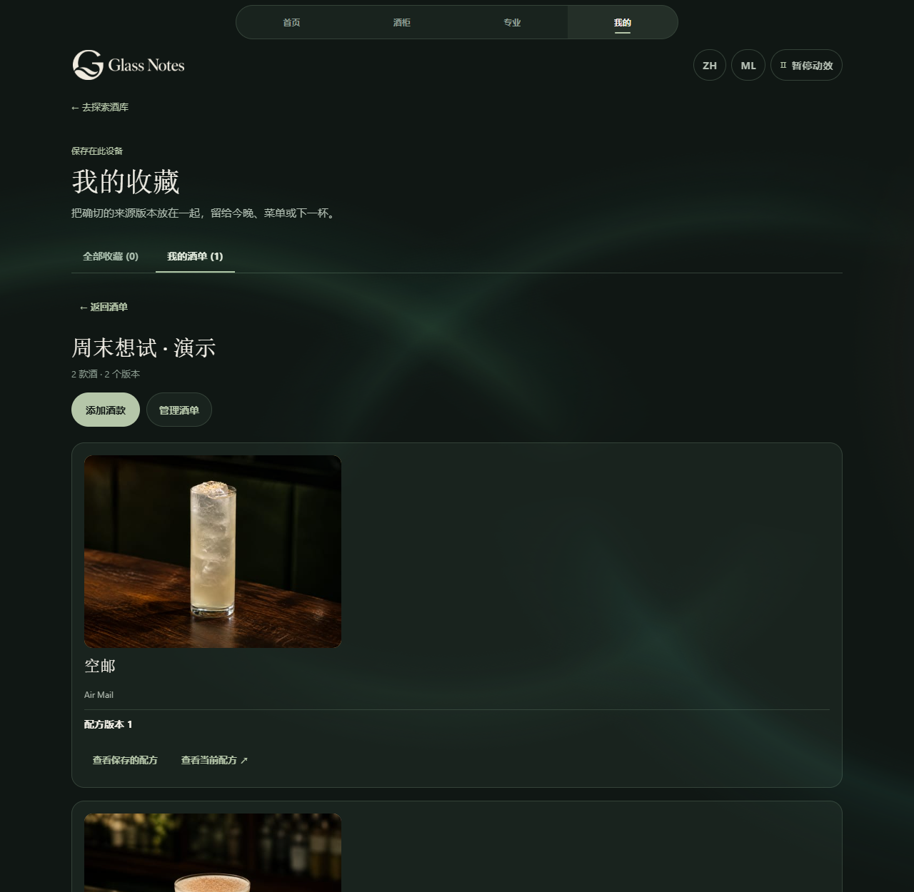

在配方中选择“记录口味”，直接打开“酒名的风味体验”。可以记录喝过或调过、喜欢或不喜欢、是否太甜或太烈、喜欢的香气，以及私人笔记。

保存的口味评价可以用于之后的选酒推荐。每次定制时，都可以选择是否使用口味记忆。

### 我的配方：写下来，也留下自己的照片

可以从空白创建配方，也可以从酒库的确切版本或实验室复制一份再调整。材料、用量、步骤、杯型、装饰和笔记由自己编辑，保存修改会保留历史版本。

为自己的配方选一张照片，和材料、步骤、笔记一起保存。导出备份时，照片也会一并保留。

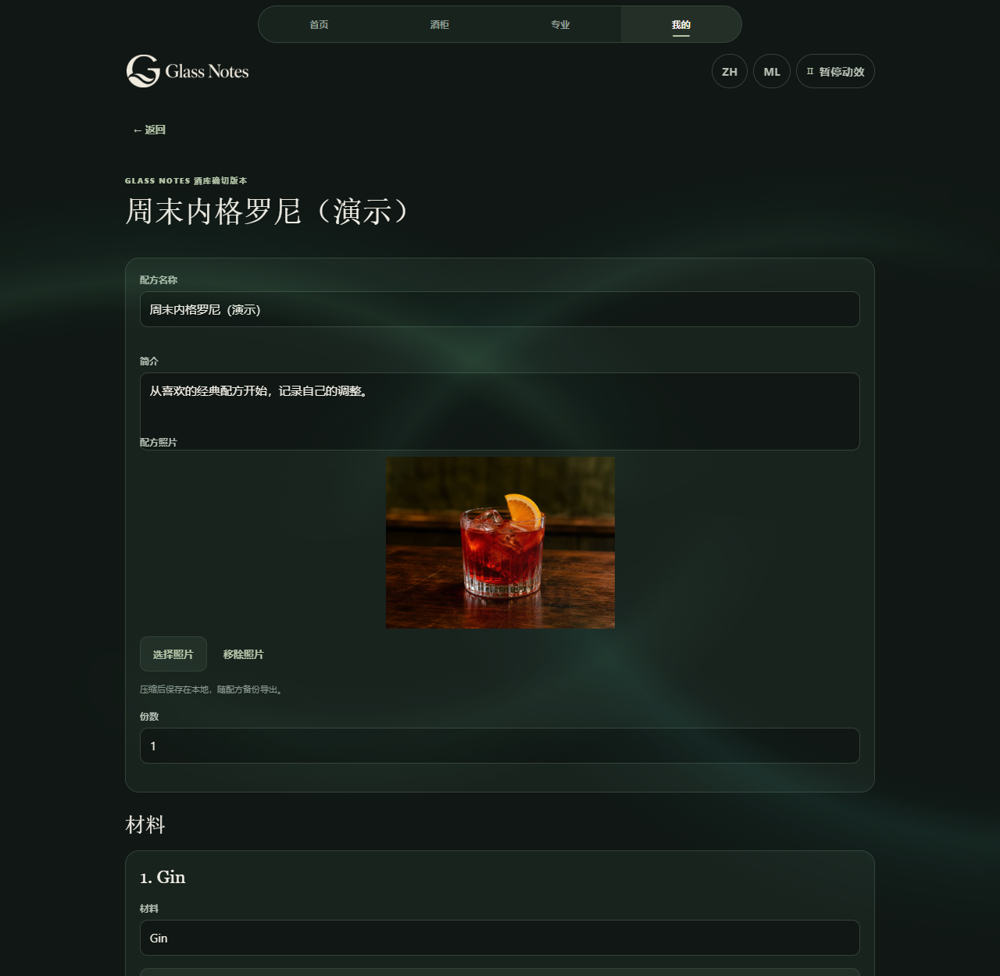

### 专业区：专题研究与我的实验室

| 工具 | 可以做什么 |
| --- | --- |
| 专题研究 | 按国家、赛事与酒吧探索整理过的作品，打开已纳入酒库的确切版本。 |
| 瓶款比较 | 并排比较产品资料，从空白或已有配方建立不同瓶款的对照项目。 |
| 配方版本 | 建立项目、编辑用量与手法、复制为下一版，并比较版本差异。 |
| 试调批次 | 保留当次配方快照，记录时间、温度、香气、口感、外观、结果和下一步。 |
| 结果对照 | 比较实际批次，从选定快照继续建立命名版本，或存为“我的配方”。 |

实验室记录自动保存到本地，方便下次试调时接着修改。

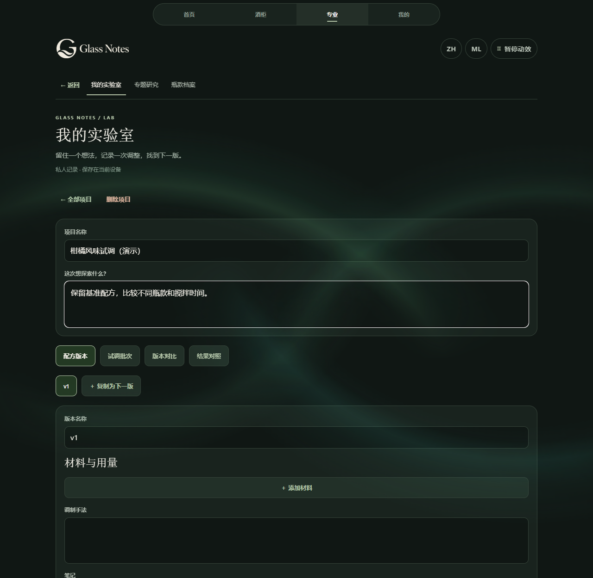

### 八种语言与跨屏体验

支持中文、English、Français、Deutsch、Español、한국어、日本語、Italiano。首次使用参考设备语言，也可在工具栏切换。酒款和瓶款名称随所选语言显示，下方保留不同的原名，方便对照查找。

电脑与手机网页均可使用全部功能。液体用量支持 ml / fl oz 切换，其他计量保留原单位。页面转场、酒图瀑布和背景流光可暂停，也会遵循系统的减少动态效果设置。

## 本地数据与备份

收藏、酒单、酒柜、私人配方、实验、调制记录、口味记忆及偏好保存在当前浏览器或应用中，不会自动同步到其他设备。

换设备时，在“我的 → 备份与恢复”导出 JSON 文件，再到新设备导入。检查恢复预览中的分类和冲突后，选择合并或替换。

请注意：

- 不同浏览器、配置、应用安装，以及不同协议、域名或端口的网页，拥有各自的数据。
- 清除站点数据、无痕会话结束或卸载可能丢失记录。迁移前先导出备份。
- 备份包含私人笔记和照片，**没有加密**，请妥善保管，避免公开分享。
- “替换”可能移除所选分类中的现有记录；先查看恢复预览并保存旧备份。
- 网页版加载页面和资源需要网络。

## 开始使用

网页版无需安装。Windows 用户可下载上方的 ZIP，解压后运行安装程序；升级前请先导出个人数据备份。

### 从源码运行

需要 Node.js 24 和 npm：

```sh
git clone https://github.com/AlexShen-Oguri/glass-note.git
cd glass-note
npm ci
npm run web
```

若要运行与静态部署相同的导出：

```sh
npm run build:web
npm run preview
```

打开 http://127.0.0.1:4173。源码变化后重新构建；预览服务仅用于本地测试。

## 开发与构建

项目使用 Expo / React Native / TypeScript，共享业务规则与界面；Windows 使用 Tauri 2 加载静态 Web 导出。运行时不需要应用后端、数据库或模型 API 密钥。

```sh
npm run validate
npm run brand:check
```

`validate` 包含类型检查、行为与内容测试、Web 导出和 iOS JavaScript / 资源导出。iOS 原生构建与签名需另行完成。

Windows x64 构建：

```sh
npm run desktop:prepare
npm run desktop:test
npm run desktop:build
```

需要 Rust MSVC 工具链、Visual Studio C++ 构建工具和 Windows SDK。安装包面向当前用户；安装后运行依赖 WebView2，不要求使用者安装 Node.js 或 Expo。macOS / Linux 安装包不在当前交付范围。

独立网站打包：

```sh
npm run release:web
```

在 `release/` 生成静态网站归档、文件校验信息及 Caddy 配置示例。将其中的 `site/` 内容部署到静态托管服务即可。

| 目录 | 内容 |
| --- | --- |
| `src/app`、`src/features` | 路由与界面 |
| `src/domain` | 搜索、推荐、快照、计算与校验 |
| `src/content`、`src/media`、`assets` | 酒库、瓶款、材料、多语言资料与图片 |
| `src/platform` | 本地存储、文件选择、恢复和平台适配 |
| `src-tauri` | Windows 宿主与受限文件桥接 |
| `scripts`、`deploy` | 测试、构建、打包与自托管示例 |

详见[架构说明](docs/ARCHITECTURE.md)、[自托管指南](docs/HOSTING.md)和[贡献指南](CONTRIBUTING.md)。

## 版本与反馈

当前 Windows 版本为 0.1.8 公开测试版，安装包尚未签名。版本详情、测试范围及下载校验信息见[发布说明](https://github.com/AlexShen-Oguri/glass-note/releases/tag/v0.1.8)。

报告普通问题时，请提供复现步骤、平台和版本，不要上传私人备份、凭据或个人资料。

## 来源与许可

自有应用代码采用 [MIT](LICENSE)，版权署名为 2026 AlexShen-Oguri。第三方依赖、照片、数据集、参考资料和商标保留各自条款，不自动适用 MIT。

鸡尾酒配图包含 AI 创作图像，配方详情和图片清单中记录了来源与生成方式。部分酒名采用编辑译名，风味描述与酒精度仅供参考。

部分第三方产品照片的再分发授权尚未确认，README 截图中的素材也适用各自的许可。复用前请查阅[第三方说明](THIRD_PARTY_NOTICES.md)、[照片署名](assets/photos/ATTRIBUTION.md)和相应素材清单。
