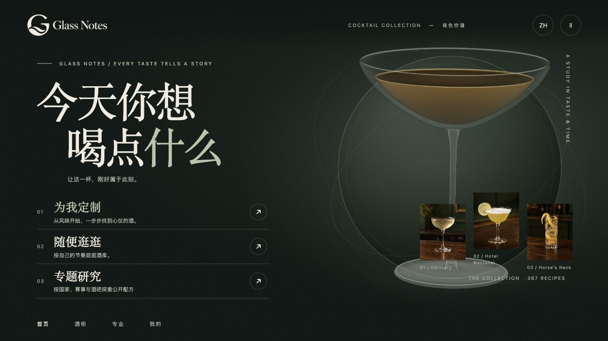
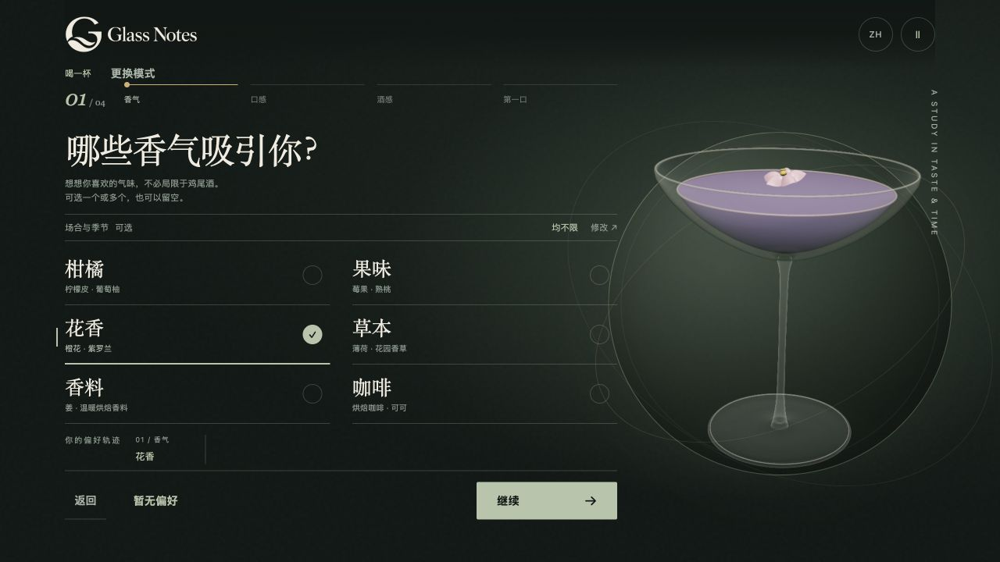
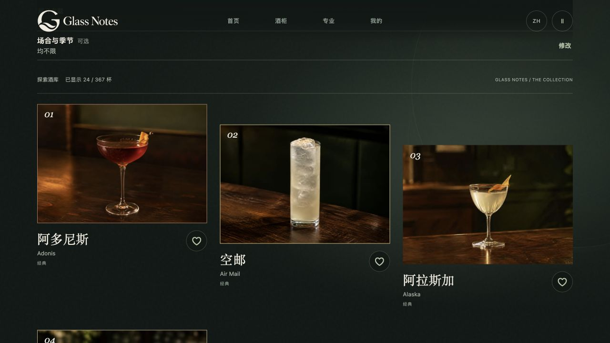
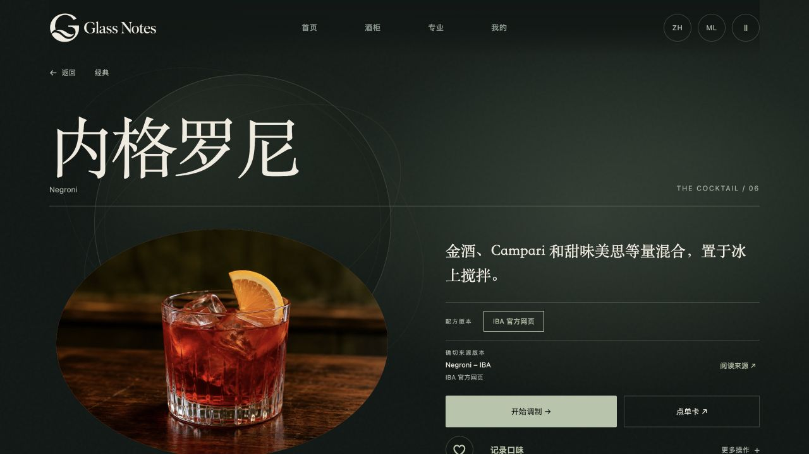
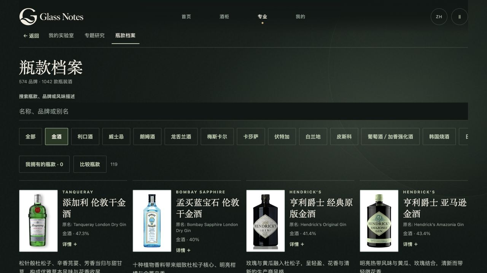
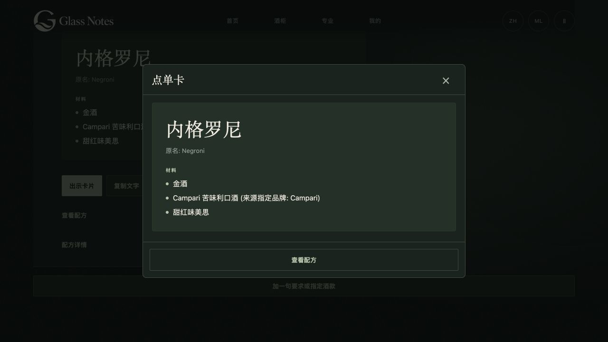
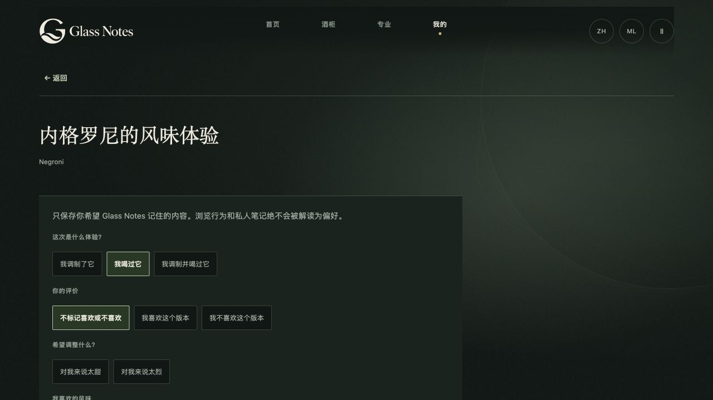

# Glass Notes

中文 · [English](README.en.md)

从今天想喝什么，到记住自己喜欢什么。Glass Notes 是一款专注个人体验的鸡尾酒工具：按口味选酒，用手边材料调酒，保存自己的配方、酒单和风味笔记。

**367 款鸡尾酒 · 371 个来源版本 · 1,042 款瓶装酒 · 8 种界面语言**



[功能介绍](#功能介绍) · [开始使用](#开始使用) · [本地数据](#本地数据与备份) · [开发与构建](#开发与构建) · [来源与许可](#来源与许可)

[打开网页版](https://glass-notes.pages.dev/) · [下载 Windows / macOS 1.0.0 正式版](https://github.com/AlexShen-Oguri/glass-note/releases/tag/v1.0.0)

在电脑或手机浏览器中直接使用，也可以下载 Windows 或 macOS 桌面版。无需注册，个人记录保存在自己的设备上。

## 功能介绍

### 按心情选一杯，或用已有材料自己调

从首页进入“为我定制”，先选一种模式，再回答香气、口感、酒感和第一口的偏好。可以多选或跳过，也可以加入场合、季节条件，以及自己保存的口味记忆。

选择会在右侧的酒杯中留下可见的变化：柑橘、果味、花香、草本、香料和咖啡带来不同装饰与酒液颜色；口感、酒感和第一口改变持续的波纹与液体运动。这些是风味的视觉表达，不代表实际配方或测得的酒精度。

| 喝一杯 | 自己调 |
| --- | --- |
| 从口味出发寻找合适的酒。 | 根据酒柜里已有的材料和瓶款推荐配方。 |
| 查看推荐理由，再进入具体配方。 | **先基酒齐全，同组再按缺料数量排序**；排除缺少 3 种及以上材料的配方，并列出缺项。 |

酒柜为空时，可以先添加材料，也可以直接按口味选酒。制作前请查看配方，确认用量、器具及需要提前准备的材料。



点击“找一杯适合我的”，文字淡出，酒杯移到中央旋转，再由推荐结果接替。可以直接跳过动效查看结果。推荐保留具体来源版本及匹配理由；展示区域根据结果数量安排单杯、双杯或多列布局。

### 看着图片逛酒单，找到确切配方

“随便逛逛”支持名称、别名和材料检索，以及基酒、材料包含与排除、风味、手法和无酒精条件。也可以按经典鸡尾酒、竞赛作品、知名酒吧配方浏览，结合场合与季节缩小选择。

每款酒用一张卡片展示，详情中可以切换不同来源的配方。筛选会找到同时满足所选条件的版本，点击卡片即可查看。



配方详情提供材料与用量、制作步骤、杯型、装饰、预制说明和风味提示。可以对照原文阅读步骤，也可以打开配方出处和图片来源。



### 酒柜、材料库与瓶款档案

在酒柜中标记已有的材料和瓶款，“自己调”就能据此推荐配方。

材料库帮助查看材料及相关配方；瓶款档案支持名称、品牌、别名和风味描述搜索，以及品类筛选。可查看瓶图、酒精度与产品说明，标记拥有，或选择瓶款进行比较。



### 跟着配方调制，或出示一张点单卡

点击“开始调制”，按顺序查看材料、步骤和制作提示。进度会自动保存，做完后可以再调一杯或返回酒单。

配方会根据材料用量与瓶款资料自动估算酒精度，资料不足时留空。数值为融冰前的估算范围，不能用于判断驾驶或饮酒安全。

点单卡把酒名、材料和明确的个人要求放在简洁卡片中，可选择应用语言或来源语言、出示卡片、复制文字，或在平台支持时分享文字。私人风味笔记不会混入点单内容。



### 我的收藏、私人酒单与口味记忆

喜欢一个配方可以直接收藏；想为周末、聚会或试饮整理一组酒，可以创建私人酒单。“添加酒款”进入同一套图片酒库，选好具体版本后加入。

酒单保留添加时的确切配方快照，可以分别查看保存的配方和酒库中的当前配方。卡片显示酒图，同款酒的不同来源版本归在一起。

在配方中选择“记录口味”，直接打开“酒名的风味体验”。可以记录喝过或调过、喜欢或不喜欢、是否太甜或太烈、喜欢的香气，以及私人笔记。

保存的口味评价可以用于之后的选酒推荐。每次定制时，都可以选择是否使用口味记忆。



### 我的配方：写下来，也留下自己的照片

可以从空白创建配方，也可以从酒库的确切版本或实验室复制一份再调整。材料、用量、步骤、杯型、装饰和笔记由自己编辑，保存修改会保留历史版本。

为自己的配方选一张照片，和材料、步骤、笔记一起保存。导出备份时，照片也会一并保留。

### 专业区：专题研究与我的实验室

| 工具 | 可以做什么 |
| --- | --- |
| 专题研究 | 按国家、赛事与酒吧探索整理过的作品，打开已纳入酒库的确切版本。 |
| 瓶款比较 | 并排比较产品资料，从空白或已有配方建立不同瓶款的对照项目。 |
| 配方版本 | 建立项目、编辑用量与手法、复制为下一版，并比较版本差异。 |
| 试调批次 | 保留当次配方快照，记录时间、温度、香气、口感、外观、结果和下一步。 |
| 结果对照 | 比较实际批次，从选定快照继续建立命名版本，或存为“我的配方”。 |

实验室记录自动保存到本地，方便下次试调时接着修改。

### 八种语言与跨屏体验

支持中文、English、Français、Deutsch、Español、한국어、日本語、Italiano。首次使用参考设备语言，也可在工具栏切换。酒款和瓶款名称随所选语言显示，下方保留不同的原名，方便对照查找。

电脑与手机网页均可使用全部功能。液体用量支持 ml / fl oz 切换，其他计量保留原单位。

界面以深绿、象牙白、大字标题和细分隔线贯穿首页、选酒与个人记录。首页每次新访问从酒库抽取三杯不同的酒，可以直接打开配方；调整窗口或切换语言不会更换这组三杯。酒图从列表衔接到配方页，风味选择与酒杯保持联动。

动效可以暂停，并遵循系统的“减少动态效果”偏好；页面进入后台或模型离屏时停止持续运动。动画不会延迟筛选或保存操作。README 中的图片均为当前应用实际界面截图。

## 本地数据与备份

收藏、酒单、酒柜、私人配方、实验、调制记录、口味记忆及偏好保存在当前浏览器或应用中，不会自动同步到其他设备。

换设备时，在“我的 → 备份与恢复”导出 JSON 文件，再到新设备导入。检查恢复预览中的分类和冲突后，选择合并或替换。

请注意：

- 不同浏览器配置、网页来源（协议、域名或端口）和设备拥有各自的数据；同一系统用户下的桌面应用副本与升级版本共用固定的应用数据目录。
- 清除站点数据、无痕会话结束或卸载可能丢失记录。迁移前先导出备份。
- 备份包含私人笔记和照片，**没有加密**，请妥善保管，避免公开分享。
- “替换”可能移除所选分类中的现有记录；先查看恢复预览并保存旧备份。
- 网页版加载页面和资源需要网络。

## 开始使用

网页版无需安装。Windows 用户下载 `windows-x64-setup.exe` 后运行安装程序；macOS 12 及以上用户下载 `macos-universal.dmg`，打开后将 Glass Notes 拖入 Applications，同时支持 Apple Silicon 和 Intel。升级前请先导出个人数据备份，并退出旧版本。

当前 macOS 测试版使用 ad-hoc 签名，尚未通过 Apple 公证；首次打开可能需要在系统设置的「隐私与安全性」中选择「仍要打开」。Windows 安装包也尚未签名。请核对 Release 的 SHA256 校验信息。应用内暂不提供自动更新，后续版本需下载新的安装包覆盖安装。

### 从源码运行

需要 Node.js 24 和 npm：

```sh
git clone https://github.com/AlexShen-Oguri/glass-note.git
cd glass-note
npm ci
npm run web
```

若要运行与静态部署相同的导出：

```sh
npm run build:web
npm run preview
```

打开 http://127.0.0.1:4173。源码变化后重新构建；预览服务仅用于本地测试。

## 开发与构建

项目使用 Expo / React Native / TypeScript，共享业务规则与界面；Windows 和 macOS 使用 Tauri 2 加载静态 Web 导出。Web 与桌面使用 Three.js 酒杯模型及 GSAP 转场；iOS 保留原生呈现适配。运行时不需要应用后端、数据库或模型 API 密钥，字体与产品资料随应用打包。

```sh
npm run validate
npm run brand:check
```

`validate` 包含类型检查、行为与内容测试、Web 导出和 iOS JavaScript / 资源导出。iOS 原生构建与签名需另行完成。

Windows x64 构建：

```sh
npm run desktop:prepare
npm run desktop:test
npm run desktop:build
```

需要 Rust MSVC 工具链、Visual Studio C++ 构建工具和 Windows SDK。安装包面向当前用户；安装后运行依赖 WebView2，不要求使用者安装 Node.js 或 Expo。

macOS 通用安装包构建（需要 Rust 和 Xcode Command Line Tools）：

```sh
rustup target add aarch64-apple-darwin x86_64-apple-darwin
npm run desktop:test
npm run desktop:build -- --target universal-apple-darwin
```

`.github/workflows/desktop-release.yml` 在版本标签推送或手动触发时分别使用 Windows、macOS runner 构建，检查 Windows 0.1.11 升级的数据保留，以及 macOS 双架构和签名。构建产物通过检查后再发布到 GitHub Release；Linux 尚未打包。

独立网站打包：

```sh
npm run release:web
```

在 `release/` 生成静态网站归档、文件校验信息及 Caddy 配置示例。将其中的 `site/` 内容部署到静态托管服务即可。

| 目录 | 内容 |
| --- | --- |
| `src/app`、`src/features` | 路由与界面 |
| `src/domain` | 搜索、推荐、快照、计算与校验 |
| `src/content`、`src/media`、`assets` | 酒库、瓶款、材料、多语言资料与图片 |
| `src/platform` | 本地存储、文件选择、恢复和平台适配 |
| `src-tauri` | Windows / macOS 宿主与受限文件桥接 |
| `scripts`、`deploy` | 测试、构建、打包与自托管示例 |

详见[架构说明](docs/ARCHITECTURE.md)、[自托管指南](docs/HOSTING.md)和[贡献指南](CONTRIBUTING.md)。

## 版本与反馈

当前桌面版本为 1.0.0，项目的首个正式版本。版本详情、测试范围及下载校验信息见[发布说明](https://github.com/AlexShen-Oguri/glass-note/releases/tag/v1.0.0)。

报告普通问题时，请提供复现步骤、平台和版本，不要上传私人备份、凭据或个人资料。

## 来源与许可

自有应用代码采用 [MIT](LICENSE)，版权署名为 2026 AlexShen-Oguri。第三方依赖、照片、数据集、参考资料和商标保留各自条款，不自动适用 MIT。

鸡尾酒配图包含 AI 创作图像，配方详情和图片清单中记录了来源与生成方式。部分酒名采用编辑译名，风味描述与酒精度仅供参考。

部分第三方产品照片的再分发授权尚未确认，README 截图中的素材也适用各自的许可。复用前请查阅[第三方说明](THIRD_PARTY_NOTICES.md)、[照片署名](assets/photos/ATTRIBUTION.md)和相应素材清单。
